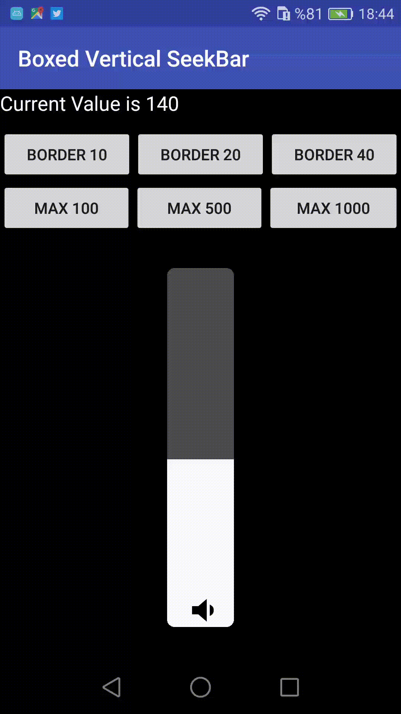

# BoxedVerticalSeekBar

A customizable vertical SeekBar for Android with box design.



## Installation

### Gradle

Add JitPack repository to your root build.gradle:

```gradle
allprojects {
    repositories {
        ...
        maven { url 'https://jitpack.io' }
    }
}
```

Add the dependency to your app build.gradle:

```gradle
dependencies {
    implementation 'com.github.alpbak:BoxedVerticalSeekBar:1.1.2'
}
```

## Usage

### XML

```xml
<abak.tr.com.boxedverticalseekbar.BoxedVertical
    android:id="@+id/boxed_vertical"
    android:layout_width="60dp"
    android:layout_height="250dp"
    app:backgroundColor="#FF0000"
    app:progressColor="#00FF00"
    app:textColor="#0000FF"
    app:cornerRadius="10"
    app:textSize="16sp"
    app:min="0"
    app:max="100"
    app:defaultValue="50"
    app:step="1"
    app:touchDisabled="false"
    app:textEnabled="true"
    app:textBottomPadding="20" />
```

### Java

```java
BoxedVertical boxedVertical = findViewById(R.id.boxed_vertical);
boxedVertical.setValue(75); // Set a specific value
int currentValue = boxedVertical.getValue(); // Get current value

// Set a listener
boxedVertical.setOnBoxedPointsChangeListener(new BoxedVertical.OnValuesChangeListener() {
    @Override
    public void onPointsChanged(BoxedVertical boxedPoints, int points) {
        // Do something when value changes
    }

    @Override
    public void onStartTrackingTouch(BoxedVertical boxedPoints) {
        // Called when touch starts
    }

    @Override
    public void onStopTrackingTouch(BoxedVertical boxedPoints) {
        // Called when touch stops
    }
});
```

## Customizable Attributes

| Attribute | Description | Default |
|-----------|-------------|---------|
| backgroundColor | Background color | #FFFFFF |
| progressColor | Progress bar color | #FF0000 |
| textColor | Text color | #000000 |
| cornerRadius | Corner radius of the box | 10 |
| textSize | Size of the text | 26sp |
| min | Minimum value | 0 |
| max | Maximum value | 100 |
| defaultValue | Default value | 50 |
| step | Step size for increments | 10 |
| touchDisabled | Disable touch events | true |
| textEnabled | Enable/disable text | true |
| textBottomPadding | Bottom padding for text | 20 |
| imageEnabled | Enable/disable images | false |
| defaultImage | Default image | null |
| minImage | Image for minimum value | null |
| maxImage | Image for maximum value | null |

## License

This project is licensed under the MIT License - see the LICENSE file for details.